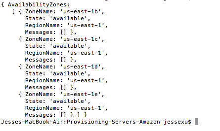
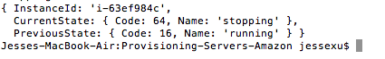
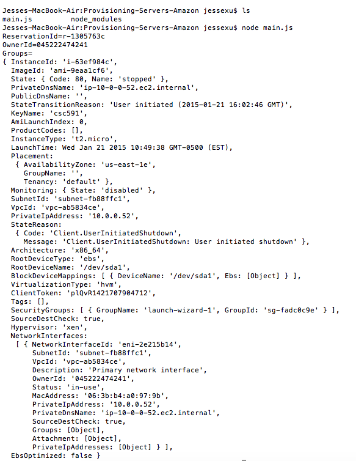
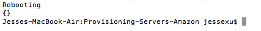

# Provisioning-Servers-Amazon
## Description on Amazon EC2
Amazon Elastic Compute Cloud (Amazon EC2) is a web service that makes web-scale computing much easier for developers and system administrators by offering resizable compute capacity in the cloud. It enables users to increase or decrease the capacity of all the hundreds and thousands of servers within minutes. It also has auto-scaling features which will cater for demand spikes and lulls and minimize the costs as well as maintaining the performance. It also allows users to choose their own configurations of CPU, memory, storage, Operating systems and GPU.
  
  It is reliable and secure as it provide secured and robust networking resources since it works with Amazon VPC. It also works in conjunction with lots of other Amazon Web Services, which include  Amazon Simple Storage Service (Amazon S3), Amazon Relational Database Service (Amazon RDS), Amazon SimpleDB and Amazon Simple Queue Service (Amazon SQS) to provide a better and complete cloud computing solutions to users. Other than all the services provided by Amazon EC2, it is also known to have a reasonable price as you only pay for what you use and has no long-term commitments, which could make the cost for planing, purchasing and maintaining hardware into a small number.

##Implemented following function in EC2 API in Javascript

1. List Available Zone
 Using describeAvailabilityZones(params = {}, callback) ⇒ AWS.Request to implement.

  

2. Start the existing instance

  

3. Stop the existing instance

  

4. Show the detailed infomation on a existing instance

  

5. Reboot the exising instances

  
